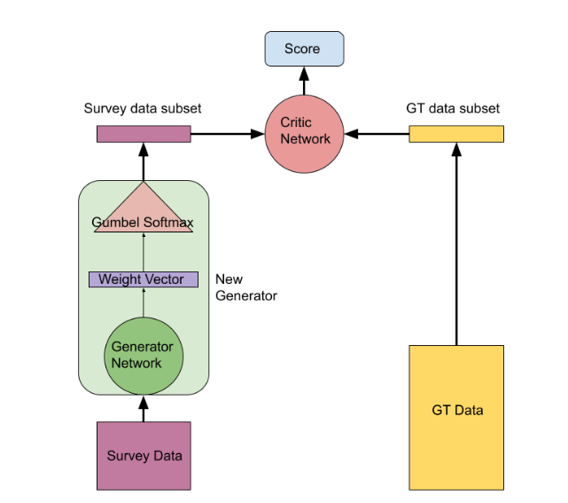

# RWGAN/RandomSamplingGAN

## Overview
This repository contains a novel solution to the problem of survey reweighting: Taking a cheap biased non-probability survey and a census and finding weights for the survey such that the survey becomes more representative of the population level statistics. 

The solution is an adaptation of Wasserstein Generative Adversarial Networks (WGANs). We adapt a WGAN generator to produce a weight distribution over a survey rather than synthesize new data. 

## Table of Contents

## Features

## Installation
